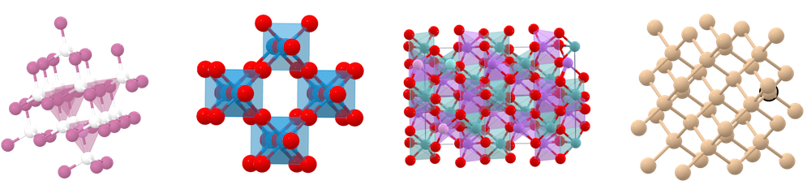

# Leaderboard 

**Matbench is an automated leaderboard** for benchmarking state of the art ML algorithms predicting a **diverse range of solid materials' properties**. It is hosted and maintained by [the Materials Project](https://materialsproject.org). 

 

- `115` **total task submissions**
- `16` **algorithms** 
- `1` **benchmark test suites**

 Scroll down to learn more.

## Leaderboard: General Purpose Algorithms on `matbench_v0.1`

Find more information about this benchmark on [the benchmark info page](Benchmark%20Info/matbench_v0.1.md)

| Task name | Samples | Algorithm | Verified MAE (unit) or ROCAUC | Notes |
|------------------|---------|-----------|----------------------|-------|
| [matbench_steels](Leaderboards%20Per-Task/matbench_v0.1_matbench_steels.md) | 312 | [MODNet (v0.1.12)](Full%20Benchmark%20Data/matbench_v0.1_modnet_v0.1.12.md) | **87.7627 (MPa)** |  |
| [matbench_jdft2d](Leaderboards%20Per-Task/matbench_v0.1_matbench_jdft2d.md) | 636 | [MODNet (v0.1.12)](Full%20Benchmark%20Data/matbench_v0.1_modnet_v0.1.12.md) | **33.1918 (meV/atom)** |  |
| [matbench_phonons](Leaderboards%20Per-Task/matbench_v0.1_matbench_phonons.md) | 1,265 | [ALIGNN](Full%20Benchmark%20Data/matbench_v0.1_alignn.md) | **29.5385 (cm^-1)** | structure required |
| [matbench_expt_gap](Leaderboards%20Per-Task/matbench_v0.1_matbench_expt_gap.md) | 4,604 | [MODNet (v0.1.12)](Full%20Benchmark%20Data/matbench_v0.1_modnet_v0.1.12.md) | **0.3327 (eV)** |  |
| [matbench_dielectric](Leaderboards%20Per-Task/matbench_v0.1_matbench_dielectric.md) | 4,764 | [MODNet (v0.1.12)](Full%20Benchmark%20Data/matbench_v0.1_modnet_v0.1.12.md) | **0.2711 (unitless)** |  |
| [matbench_expt_is_metal](Leaderboards%20Per-Task/matbench_v0.1_matbench_expt_is_metal.md) | 4,921 | [AMMExpress v2020](Full%20Benchmark%20Data/matbench_v0.1_automatminer_expressv2020.md) | **0.9209** |  |
| [matbench_glass](Leaderboards%20Per-Task/matbench_v0.1_matbench_glass.md) | 5,680 | [MODNet (v0.1.12)](Full%20Benchmark%20Data/matbench_v0.1_modnet_v0.1.12.md) | **0.9603** |  |
| [matbench_log_gvrh](Leaderboards%20Per-Task/matbench_v0.1_matbench_log_gvrh.md) | 10,987 | [ALIGNN](Full%20Benchmark%20Data/matbench_v0.1_alignn.md) | **0.0715 (log10(GPa))** | structure required |
| [matbench_log_kvrh](Leaderboards%20Per-Task/matbench_v0.1_matbench_log_kvrh.md) | 10,987 | [MODNet (v0.1.12)](Full%20Benchmark%20Data/matbench_v0.1_modnet_v0.1.12.md) | **0.0548 (log10(GPa))** |  |
| [matbench_perovskites](Leaderboards%20Per-Task/matbench_v0.1_matbench_perovskites.md) | 18,928 | [ALIGNN](Full%20Benchmark%20Data/matbench_v0.1_alignn.md) | **0.0288 (eV/unit cell)** | structure required |
| [matbench_mp_gap](Leaderboards%20Per-Task/matbench_v0.1_matbench_mp_gap.md) | 106,113 | [ALIGNN](Full%20Benchmark%20Data/matbench_v0.1_alignn.md) | **0.1861 (eV)** | structure required |
| [matbench_mp_is_metal](Leaderboards%20Per-Task/matbench_v0.1_matbench_mp_is_metal.md) | 106,113 | [CGCNN v2019](Full%20Benchmark%20Data/matbench_v0.1_cgcnnv2019.md) | **0.9520** | structure required |
| [matbench_mp_e_form](Leaderboards%20Per-Task/matbench_v0.1_matbench_mp_e_form.md) | 132,752 | [ALIGNN](Full%20Benchmark%20Data/matbench_v0.1_alignn.md) | **0.0215 (eV/atom)** | structure required |


<iframe src="static/scaled_errors_matbench_v0.1.html" class="is-fullwidth" height="1200px" width="1000px" frameBorder="0"> </iframe>


<iframe src="static/scaled_errors_non_gp_matbench_v0.1.html" class="is-fullwidth" height="1200px" width="1000px" frameBorder="0"> </iframe>

Scaled errors for regressions on this leaderboard plot are assessed as the ratio of mean absolute error to mean absolute deviation:

$$
\text{Scaled Error} = \frac{\text{MAE}}{\text{MAD}} = \frac{\sum_i^N | y_i - y_i^{pred} |}{\sum_i^N | y_i - \bar{y} | }
$$


## Overview

[Matbench](https://doi.org/10.1038/s41524-020-00406-3) is an [ImageNet](http://www.image-net.org) for **materials science**; a
**curated set of 13 supervised, pre-cleaned, ready-to-use ML tasks** for benchmarking and fair comparison. The tasks span a wide domain of
inorganic materials science applications including electronic, thermodynamic, mechanical, and thermal properties among crystals, 2D materials,
disordered metals, and more.  

**The [Matbench python package](https://github.com/hackingmaterials/matbench) provides everything needed to use Matbench with your ML algorithm in ~10 lines of code or less.** The web pages and repository online contain full result files, citations, methodologies, and code for the algorithms shown.


## What can Matbench offer?

### This website


- **Leaderboard of results for state-of-the-art materials ML algorithms on standardized test problems**
- Interactively explore and download the tasks on [MPContribs-ML](https://ml.materialsproject.org/browse), a platform hosted by [The Materials Project](https://materialsproject.org). See [Benchmark Info](Benchmark%20Info/matbench_v0.1/) for links to each dataset.
- **Each and every result is backed by a peer-reviewed publication and/or a jupyter notebook** (similar to Papers With Code) - i.e., how were these results were obtained?
- Glossary of all algorithms' results on the Matbench problems


### The Matbench Python package

- Probe ML algorithms strengths and weaknesses across a wide range of materials property prediction tasks
- Run a full benchmark in ~10 lines of code
- Submit results as a PR to the [Matbench repo](https://github.com/hackingmaterials/matbench) to compare with other algorithms and appear on the leaderboard
- Benchmark both **general purpose** ML models as well as algorithms specialized for particular domains


## Summary of Matbench's Tasks

Matbench's 13 tasks can be broken down into various categories; it includes both the small - less than 10,000 samples - datasets that characterize
experimental materials data as well as larger datasets from computer modelling methods like density functional theory (DFT).


Each task in Matbench consists of a three things:

1. **A set of inputs:** crystal structures or chemical compositions.
2. **A set of outputs:** target properties, such as formation energy.
3. **A test procedure:** a way to get a score for your algorithm


The Matbench Python package provides functions for getting the first two (packaged together for each task as a _dataset_) as well as running 
the test procedure. See the [How to use](How%20To%20Use/) documentation page to get started.


## Citing Matbench

You can find details and results on the benchmark in our paper [Benchmarking materials property prediction methods: the Matbench test set and Automatminer reference algorithm](https://doi.org/10.1038/s41524-020-00406-3). 
Please consider citing this paper if you use Matbench v0.1 for benchmarking, comparison, or prototyping.


You can cite Matbench using this reference:

```
Dunn, A., Wang, Q., Ganose, A., Dopp, D., Jain, A. 
Benchmarking Materials Property Prediction Methods: 
The Matbench Test Set and Automatminer Reference Algorithm. 
npj Computational Materials 6, 138 (2020). 
https://doi.org/10.1038/s41524-020-00406-3
```