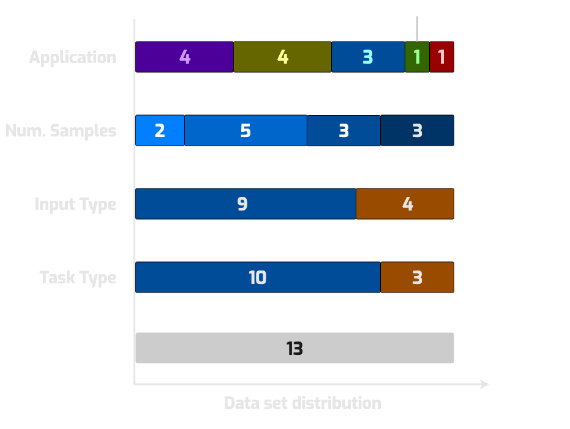

# Matbench v0.1 - Machine Learning Benchmark for Materials Science


## Leaderboard - General Purpose Algorithms


| task name                | verified top score (MAE or ROCAUC) | algorithm name, config            | notes |
| ------------------------ | ---------------------------------- | ----------------------------------- | ----------------------------------------------------------- |
| `matbench_dielectric`    | 0.299 (unitless)                   | Automatminer express v1.0.3.2019111 |                                                          |
| `matbench_expt_gap`      | 0.416 eV                           | Automatminer express v1.0.3.2019111 |                                                          |
| `matbench_expt_is_metal` | 0.92                               | Automatminer express v1.0.3.2019111 |                                                          |
| `matbench_glass`         | 0.861                              | Automatminer express v1.0.3.2019111 |                                                          |
| `matbench_jdft2d`        | 38.6 meV/atom                      | Automatminer express v1.0.3.2019111 |                                                          |
| `matbench_log_gvrh`      | 0.0849 log(GPa)                    | Automatminer express v1.0.3.2019111 |                                                          |
| `matbench_log_kvrh`      | 0.0679 log(GPa)                    | Automatminer express v1.0.3.2019111 |                                                          |
| `matbench_mp_e_form`     | 0.0327 eV/atom                     | MEGNet v0.2.2                       | structure only                                         |
| `matbench_mp_gap`        | 0.228 eV                           | CGCNN (2019)                        | structure only                                         |
| `matbench_mp_is_metal`   | 0.977                              | MEGNet v0.2.2                       | structure only                                         |
| `matbench_perovskites`   | 0.0417                             | MEGNet v0.2.2                       | structure only                                         |
| `matbench_phonons`       | 36.9 cm^-1                         | MEGNet v0.2.2                       | structure only                                         |
| `matbench_steels`        | 95.2 MPa                           | Automatminer express v1.0.3.2019111 |                                                         |

<iframe src="static/graph.html" class="is-fullwidth" height="700px" width="1000px" frameBorder="0"> </iframe>

## Overview

[Matbench](https://doi.org/10.1038/s41524-020-00406-3) is an [ImageNet](http://www.image-net.org) for **materials science**; a
**curated set of 13 supervised, pre-cleaned, ready-to-use ML tasks** for benchmarking and fair comparison. The tasks span a wide domain of
inorganic materials science applications including electronic, thermodynamic, mechanical, and thermal properties among crystals, 2D materials,
disordered metals, and more.  

**The [Matbench python package](https://github.com/hackingmaterials/matbench) provides everything needed to use Matbench with your ML algorithm in ~10 lines of code or less.**


## What can Matbench offer?

### This website


- **Leaderboard of results for state-of-the-art materials ML algorithms on standardized test problems**
- Interactively explore and download the tasks on [MPContribs-ML](https://ml.materialsproject.org/browse), a platform hosted by [The Materials Project](https://materialsproject.org). See [All Matbench Datasets](#all-matbench-datasets) for links to each dataset.
- **Each and every result is backed by a peer-reviewed publication and a jupyter notebook** (similar to Papers With Code) - i.e., how were these results were obtained?
- Glossary of all algorithms' results on the Matbench problems


### The Matbench Python package

- Probe ML algorithms strengths and weaknesses across a wide range of materials property prediction tasks
- Run a full benchmark in ~10 lines of code
- Submit results as a PR to the [Matbench repo](https://github.com/hackingmaterials/matbench) to compare with other algorithms and appear on the leaderboard
- Benchmark both **general purpose** ML models as well as algorithms specialized for particular domains


## Summary of Matbench's Tasks

Matbench's 13 tasks can be broken down into various categories; it includes both the small - less than 10,000 samples - datasets that characterize
experimental materials data as well as larger datasets from computer modelling methods like density functional theory (DFT).





Each task in Matbench consists of a three things:

1. **A set of inputs:** crystal structures or chemical compositions.
2. **A set of outputs:** target properties, such as formation energy.
3. **A test procedure:** a way to get a score for your algorithm


The Matbench Python package provides functions for getting the first two (packaged together for each task as a _dataset_) as well as running 
the test procedure. See the [Runnning and Submitting Benchmarks](running_and_submitting_benchmarks.md) documentation page to get started.


## All Matbench Datasets

| task name                | target column (unit)         | number of samples | task type      | links                                                                                                                                                                |
| ------------------------ | ---------------------------- | ----------------- | -------------- | -------------------------------------------------------------------------------------------------------------------------------------------------------------------- |
| `matbench_dielectric`    | `n` (unitless)               | 4,764              | regression     | [download](https://ml.materialsproject.org/projects/matbench_dielectric.json.gz), [interactive](https://ml.materialsproject.org/projects/matbench_dielectric/)       |
| `matbench_expt_gap`      | `gap expt` (eV)              | 4,604              | regression     | [download](https://ml.materialsproject.org/projects/matbench_expt_gap.json.gz), [interactive](https://ml.materialsproject.org/projects/matbench_expt_gap/)           |
| `matbench_expt_is_metal` | `is_metal` (unitless)        | 4,921              | classification | [download](https://ml.materialsproject.org/projects/matbench_expt_is_metal.json.gz), [interactive](https://ml.materialsproject.org/projects/matbench_expt_is_metal/) |
| `matbench_glass`         | `gfa` (unitless)             | 5,680              | classification | [download](https://ml.materialsproject.org/projects/matbench_glass.json.gz), [interactive](https://ml.materialsproject.org/projects/matbench_glass/)                 |
| `matbench_jdft2d`        | `exfoliation_en` (meV/atom)  | 636                | regression     | [download](https://ml.materialsproject.org/projects/matbench_jdft2d.json.gz), [interactive](https://ml.materialsproject.org/projects/matbench_jdft2d/)               |
| `matbench_log_gvrh`      | `log10(G_VRH)` (log(GPa))    | 10,987             | regression     | [download](https://ml.materialsproject.org/projects/matbench_log_gvrh.json.gz), [interactive](https://ml.materialsproject.org/projects/matbench_log_gvrh/)           |
| `matbench_log_kvrh`      | `log10(K_VRH)` (log(GPa))    | 10,987             | regression     | [download](https://ml.materialsproject.org/projects/matbench_log_kvrh.json.gz), [interactive](https://ml.materialsproject.org/projects/matbench_log_kvrh/)           |
| `matbench_mp_e_form`     | `e_form` (eV/atom)           | 132,752            | regression     | [download](https://ml.materialsproject.org/projects/matbench_mp_e_form.json.gz), [interactive](https://ml.materialsproject.org/projects/matbench_mp_e_form/)         |
| `matbench_mp_gap`        | `gap pbe` (eV)               | 106,113            | regression     | [download](https://ml.materialsproject.org/projects/matbench_mp_gap.json.gz), [interactive](https://ml.materialsproject.org/projects/matbench_mp_gap/)               |
| `matbench_mp_is_metal`   | `is_metal` (unitless)        | 106,113            | classification | [download](https://ml.materialsproject.org/projects/matbench_mp_is_metal.json.gz), [interactive](https://ml.materialsproject.org/projects/matbench_mp_is_metal/)     |
| `matbench_perovskites`   | `e_form` (eV, per unit cell) | 18,928             | regression     | [download](https://ml.materialsproject.org/projects/matbench_perovskites.json.gz), [interactive](https://ml.materialsproject.org/projects/matbench_perovskites/)     |
| `matbench_phonons`       | `last phdos peak` (cm^-1)    | 1,265              | regression     | [download](https://ml.materialsproject.org/projects/matbench_phonons.json.gz), [interactive](https://ml.materialsproject.org/projects/matbench_phonons/)             |
| `matbench_steels`        | `yield strength` (MPa)       | 312                | regression     | [download](https://ml.materialsproject.org/projects/matbench_steels.json.gz), [interactive](https://ml.materialsproject.org/projects/matbench_steels/)               |


## Citing Matbench

You can find details and results on the benchmark in our paper [Benchmarking materials property prediction methods: the Matbench test set and Automatminer reference ](https://doi.org/10.1038/s41524-020-00406-3). 
Please consider citing this paper if you use Matbench v0.1 for benchmarking, comparison, or prototyping.


You can cite Matbench using this reference:

```
Dunn, A., Wang, Q., Ganose, A., Dopp, D., Jain, A. 
Benchmarking Materials Property Prediction Methods: 
The Matbench Test Set and Automatminer Reference Algorithm. 
npj Computational Materials 6, 138 (2020). 
https://doi.org/10.1038/s41524-020-00406-3
```


